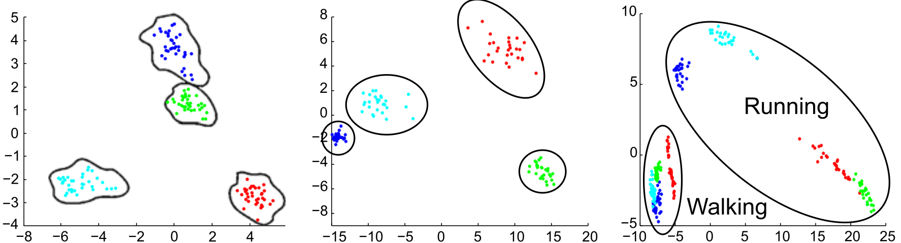
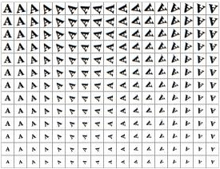
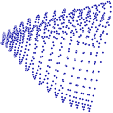
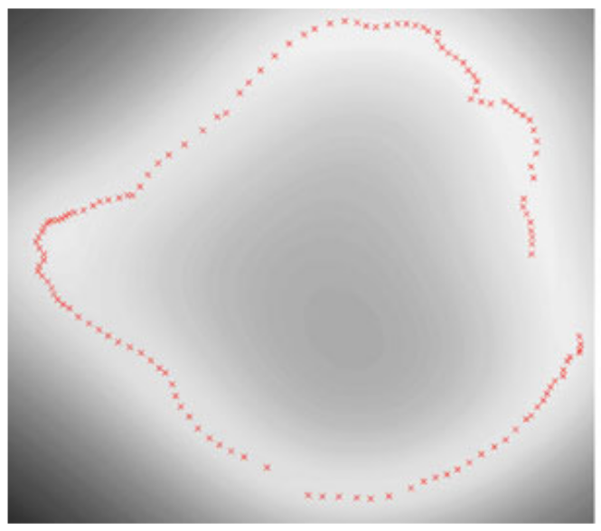
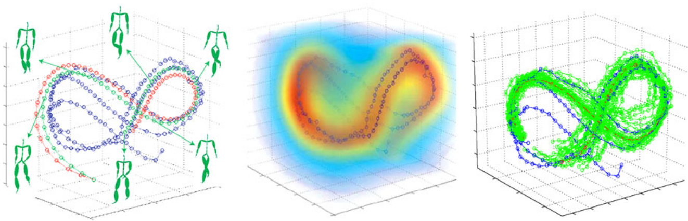
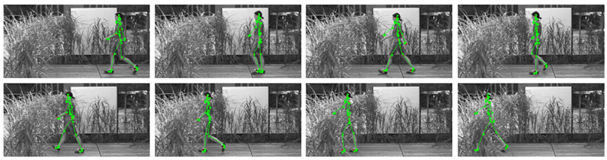
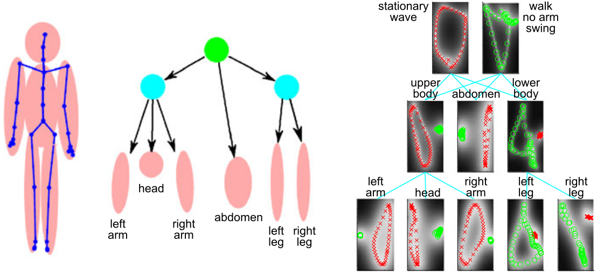

% Motion Models for People Tracking
% Alexander Höreth
% June 2016, University of Osnabrück

# Introduction
## multiple cameras...
**make motion detection straightforward**

## monocularity
makes things more difficult:

* noise
* occlusion

**we require prior information**

## prior models
sufficiently general to admit all possible motions  
<>  
strong enough to resolve ambiguities

## state of the art
activity specific models from motion capturing

**Problem:** Pose and motion data is extremely high dimensional, difficult to visualize and expensive to compute on.

<!-- ----------------------------------------------------------------------- -->
# Human Pose Tracking
## Bayesian Filtering

maximum a posterior probable motion distribution

$p(x_{1:t}|z_{1:t}) = p(z_{1:t}|x_{1:t})p(x_{1:t}) / p(z_{1:t})$  
time $t$, states $x_{1:t}$, observations $z_{1:t}$

$\rightarrow$ to complex to calculate

## further simplify-able

## initial pose guess

## Kinematic Joint Limits
limited range of motion in each joint
detected poses need to satisfy valid biomechanics
can be used to capture plausibility of pose estimates

## Smooth Motion
every new pose equals the old pose with some added noise  
$y_{t+1} = y_{t} + \eta$

$y_{t+1} = y_{t} + \kappa(y_t - y_{t-1}) + \eta$

## Linear Dynamic System

<!-- ----------------------------------------------------------------------- -->
# Linear Kinematic Models
## pose data
collected using off-line motion capturing

$\mathbb{D} = \{y^{(i)}\}_{i=1,...,\mathcal{N}}$  
$y^{(i)} \in \mathcal{R}^D$

N poses y each consisting of D joint angles

## pose space
activities exhibit strong regularities  

$\rightarrow$ data from a single activity is likely to be clustered

$\rightarrow$ eigen-poses can be constructed for complexity reduction

<!--
## Dynamic Texture
linear subspace projection and subspace LDS -->

## motion == pose seq.

$m = (y_1,...,y_m)$

## motion PCA

linear combination of mean motion and eigen-motions

$$m \approx \mu + \Sigma_{j=1 \rightarrow B} x_j b_j$$

<!-- ----------------------------------------------------------------------- -->
# Nonlinear Kinematic Models
## dimensionality reduction
{height=200px}

{height=300px}
{height=300px}

## motivation
periodic motions follow a cyclic trajectory in high dimensionality

linear models require many dimensions to appropriately span the data

nonlinear manifolds can model those structures better

## gaussian processes

univariate $\rightarrow$ multivariate $\rightarrow$ processes

## GP Latent Variable Model
utilizes gaussian processes to predict samples from latent variables

optimize likelihood of correct latent space $\rightarrow$ pose space mapping

good prior is essential, commonly uses PCA

{height=400px}

## GPLVM demo
<iframe width="640" height="480" src="https://www.youtube.com/embed/DS853uA0u4I?rel=0&start=1940&end=1980&color=white&modestbranding=1&showinfo=0" frameborder="0" allowfullscreen></iframe>

## GP Dynamical Model
GPLVM is sampled from independent training data -- ignores temporal relations

intuition for the latent space gets lost because of missing spatial proximity

<!-- TODO: not part of GPDM! -->
**smooth pose trajectories $\rightarrow$ smooth latent trajectories**

required for accurate predictions and tracking

GPDM is initialized using GP prior over latent trajectories

## GPDM demo
<!-- TODO: this actually is back-constraints -->
<iframe width="640" height="480" src="https://www.youtube.com/embed/DS853uA0u4I?rel=0&start=2320&end=2350&color=white&modestbranding=1&showinfo=0" frameborder="0" allowfullscreen></iframe>

## GPDM tracking

## Extensions
### a) Multi-Factor GPLVM
weighted sum over individual models with *side information* available

### b) Hierarchical GPLVM

## Hierarchical GPLVM Demo
<iframe width="640" height="480" src="https://www.youtube.com/embed/DS853uA0u4I?rel=0&start=2735&end=2785&color=white&modestbranding=1&showinfo=0&controls=0" frameborder="0" allowfullscreen></iframe>

# Conditional Restricted Boltzmann Machines
##

<!-- ----------------------------------------------------------------------- -->
# Thank you for your attention
## Links & References
This: [ahoereth.github.io/motion-models](https://ahoereth.github.io/motion-models)

Neil Lawrence on GPLVMs @ Google: [youtu.be/DS853uA0u4I](https://youtu.be/DS853uA0u4I)

Interactive visualizations available at [github.com/lawrennd/oxford](https://github.com/lawrennd/oxford) (seemingly broken?)

All images from [Visual Analysis of Humans](http://www.springer.com/us/book/9780857299963) (ch.10) and the respective references
